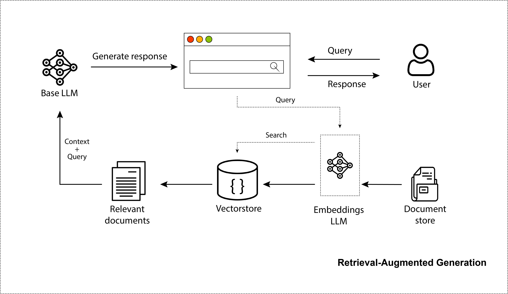
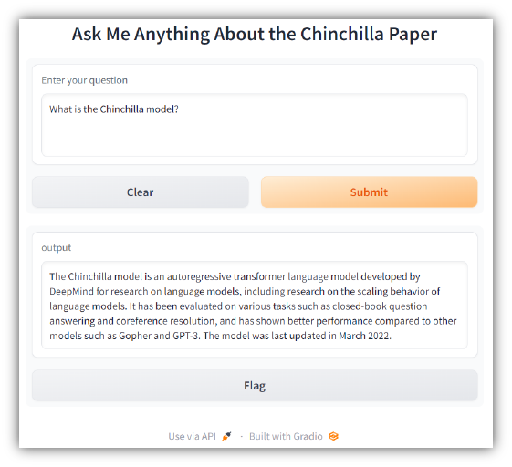

[](./notebooks/Ask_Your_Own_Data_LlamaIndex_LangChain_en.ipynb)


# Adding Private Data to LLMs
> LLMs have stunned the world with their capacity to create realistic images, code, and dialogue. Undoubtedly, ChatGPT has taken the world by storm. Millions are using it. But while it's great for general-purpose knowledge, it only knows information it was trained on, which is pre-2021 generally available internet data. It lacks awareness of your private data and remains uninformed about recent data sources. Thus, to improve them in that regard, we can provide them with information that we retrieved from a search step. This makes them more factual and gives a better ability to provide the model with up-to-date information, without the need to retrain these massive models. This is precisely what a retrieval-augmented LLM or Retrieval-Augmented Generation (RAG) system is. Indeed, this repository will precisely outline the creation of an RAG system and elucidate the optimization steps involved.

## Table of Contents
- [RAG](#rag)
- [Tech Stack](#tech-stack)
- [Installation](#installation)
- [Useful Links](#useful-links)
- [Contact](#Contact)

## RAG
<p align="center">
    
</p>

## Tech Stack
* [x] LangChain
* [x] LlamaIndex
* [x] Azure OpenAI
* [x] Gradio

## Installation
1. Clone the Github repository

    ```bash
    git clone https://github.com/zekaouinoureddine/Adding-Private-Data-to-LLMs.git
    ```

2. Requirements
Cd to the project directory and ensure that you have Python 3 installed, along with the necessary dependencies.

    ```bash
    cd Adding-Private-Data-to-LLMs
    pip install -r requirements.txt
    ```


3. Run the Gradio app

    ```bash
    python rag.py
    ```

Visit [http://127.0.0.1:7860](http://127.0.0.1:7860) on your machine to test the app. You should see something like the following:

<p align="center">
  <a href="http://127.0.0.1:7860">
    
  </a>
</p>

## Useful Links

| Blog                                                                              | Plateform                                                        | Language | Notebook                                                                                                                              |
|:---------------------------------------------------------------------------------:|:----------------------------------------------------------------:|:--------:|:-------------------------------------------------------------------------------------------------------------------------------------:|
|   [Ask Your Own Data](https://www.hiberus.com/crecemos-contigo/ask-your-own-data-generando-respuestas-sobre-datos-privados-en-entornos-seguros/)  |  [Hiberus Blog](https://www.hiberus.com/crecemos-contigo/)      | ES       |  [](./notebooks/Ask_Your_Own_Data_LlamaIndex_LangChain_es.ipynb)       |
|   [Ask Your Own Data](https://medium.com/@zekaouinoureddine/bring-your-own-data-to-llms-using-langchain-llamaindex-3ddbac8cc9eb)          |        Medium                                                    | EN       |  [](./notebooks/Ask_Your_Own_Data_LlamaIndex_LangChain_en.ipynb)       |

---
## Contact

If you like it, give it a ⭐, then follow me on:
- LinkedIn: [Nour Eddine ZEKAOUI](https://www.linkedin.com/in/nour-eddine-zekaoui-ba43b1177/)
- Twitter: [@NZekaoui](https://twitter.com/NZekaoui)

---
 
[Back To The Top](#adding-private-data-to-llms)
